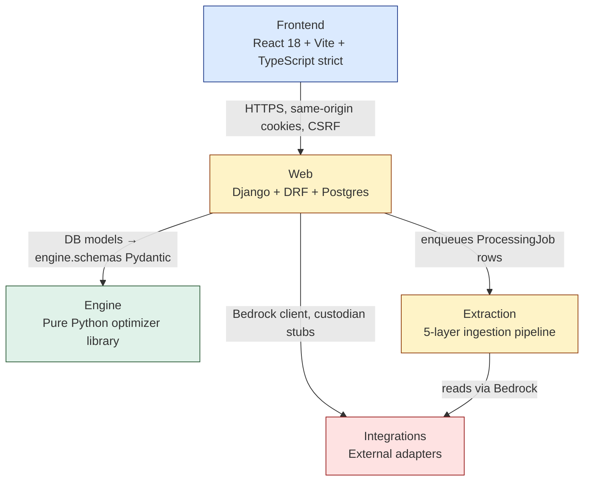
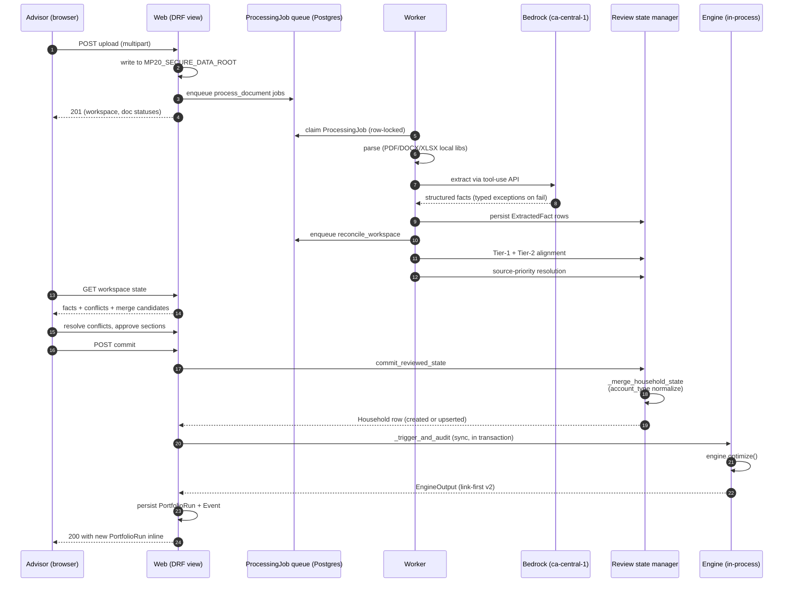
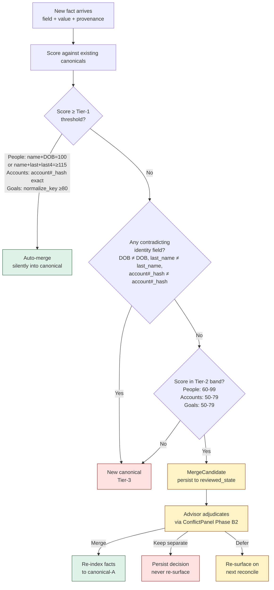
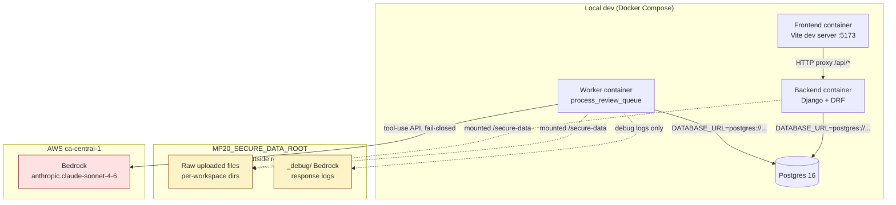
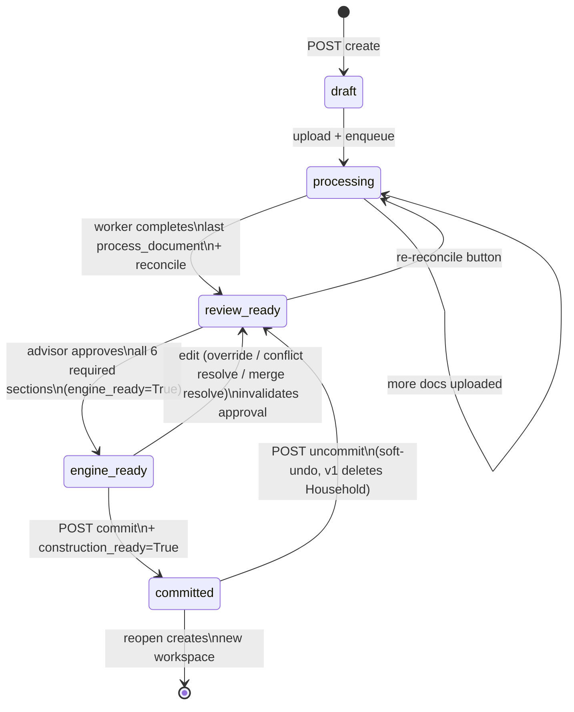
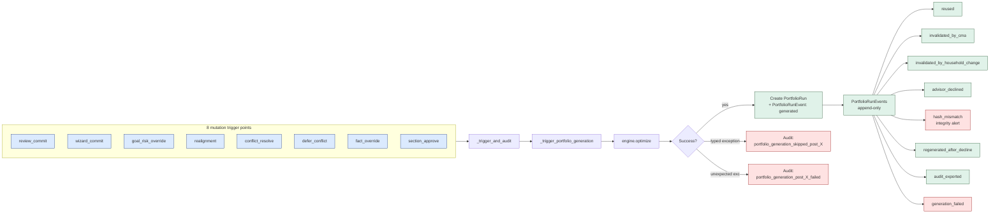

# Architecture diagrams

Six diagrams that map the most important structures and flows in MP2.0.
Each diagram has a Mermaid source (renders inline in GitHub) and an
ASCII fallback for tools that don't render Mermaid (Linear, some
Confluence importers, plaintext exports).

## Table of contents

1. [Four-layer architecture](#1-four-layer-architecture)
2. [Upload → commit → portfolio-generation data flow](#2-upload--commit--portfolio-generation-data-flow)
3. [Three-tier entity matcher decision tree](#3-three-tier-entity-matcher-decision-tree)
4. [Deployment / infrastructure](#4-deployment--infrastructure)
5. [Review-workspace state machine](#5-review-workspace-state-machine)
6. [PortfolioRun lifecycle + auto-trigger flow](#6-portfoliorun-lifecycle--auto-trigger-flow)

## How to update these diagrams

When the architecture changes:

1. Edit the Mermaid source in this file.
2. Verify it renders in GitHub (paste the Mermaid block into a draft
   issue preview, or push to a feature branch and view the diff).
3. Update the ASCII fallback to match.
4. Bump the `last_revised` date in the front-matter.
5. If the diagram now references a different ADR or canon section,
   update the "See also" line.
6. If the change affects an existing ADR's "Decision" section, supersede
   that ADR (see [`adr/CONTRIBUTING.md`](adr/CONTRIBUTING.md)).

Diagrams use default Mermaid colors — no theme overrides — so they
render consistently across GitHub, VS Code preview, and most other
Markdown renderers without theme drift.

## 1. Four-layer architecture

MP2.0 is structured in four primary layers. Each layer has strict
boundary rules enforced by tests, CI gates, or code review.



**Legend.** Boxes are subsystems. Arrows show *allowed* dependencies.
Engine (green) has **zero inbound dependencies from a forbidden-roots
set: web, extraction, integrations, django, rest_framework,
drf_spectacular, psycopg, psycopg2** — enforced by the AST purity guard
at `engine/tests/test_engine_purity.py` (`FORBIDDEN_ROOTS` is the
canonical source; check there for the current set). Frontend (blue)
depends only on web. Extraction (yellow) is a framework subsystem with
its own boundary. See [`adr/0001-engine-as-library.md`](adr/0001-engine-as-library.md)
for the full enforcement rationale.

**ASCII fallback.**

```
┌──────────────────────────────────────────────────────┐
│  FRONTEND (React + Vite + TS strict)                 │
│  - advisor console, analyst CMA Workbench            │
└─────────────────┬────────────────────────────────────┘
                  │ HTTPS, same-origin cookies, CSRF
┌─────────────────┴────────────────────────────────────┐
│  WEB (Django + DRF + Postgres)                       │
│  - authenticated endpoints, RBAC                     │
│  - DB models, audit subsystem                        │
│  - Postgres-backed worker queue                      │
└────────┬─────────────────────┬──────────────────────┘
         │                     │
┌────────┴─────────┐  ┌────────┴───────────────────┐
│  ENGINE          │  │  EXTRACTION                │
│  pure Python     │  │  5-layer pipeline          │
│  no Django/DRF   │  │  Bedrock ca-central-1      │
└──────────────────┘  └────────────────────────────┘
                          │
                     ┌────┴──────────┐
                     │ INTEGRATIONS  │
                     │ adapters      │
                     └───────────────┘
```

**See also.** [`adr/0001-engine-as-library.md`](adr/0001-engine-as-library.md);
Canon §9.4.2.

## 2. Upload → commit → portfolio-generation data flow

The critical happy-path for advisor onboarding. From file drop to
inline PortfolioRun, the system traverses every layer.



**Legend.** A vertical lifeline per actor. The auto-trigger (step from
"POST commit" to "engine.optimize") runs **synchronously inside the
mutation transaction** — no polling, no `transaction.on_commit`. The
advisor sees the new run (or the captured failure) inline in the
response.

**ASCII fallback.**

```
Advisor → web (POST upload)
         ↓
         write to MP20_SECURE_DATA_ROOT
         ↓
         enqueue ProcessingJob (process_document)
         ↓
Worker → claim row-locked job
         ↓
         parse (PDF/DOCX/XLSX local libs)
         ↓
         Bedrock ca-central-1 tool-use (fail-closed)
         ↓
         persist ExtractedFact rows
         ↓
         enqueue reconcile_workspace
         ↓
         Tier-1 + Tier-2 alignment + source-priority resolution
         ↓
Advisor ← web (workspace state: facts + conflicts + candidates)
         ↓
         resolve conflicts, approve sections, POST commit
         ↓
web → commit_reviewed_state → _merge_household_state (normalize types)
         ↓
         _trigger_and_audit (SYNC, inside the mutation transaction)
         ↓
         engine.optimize() (~270ms cold, ~10-30ms REUSED)
         ↓
         persist PortfolioRun + PortfolioRunEvent (both append-only)
         ↓
Advisor ← web (200 with PortfolioRun inline)
```

**See also.** [`adr/0005-link-first-engine-output.md`](adr/0005-link-first-engine-output.md);
[`adr/0009-sync-auto-trigger.md`](adr/0009-sync-auto-trigger.md);
[`onboarding-engineer.md`](onboarding-engineer.md) "Week 1 subsystem
tour — extraction"; Canon §11 (extraction pipeline) + Canon §12 (engine
I/O contract).

## 3. Three-tier entity matcher decision tree

When extraction produces facts about people / accounts / goals across
multiple documents, the matcher decides which canonical entity each
fact belongs to.



**Legend.** Green = auto-merge (no advisor action). Yellow = surface
to advisor for adjudication (the new Tier-2 path, shipped 2026-05-05
in commit `7274485`). Red = new canonical (or kept-separate persisted
decision).

**Why this exists.** Real LLM extraction obeys canon §9.4.5 ("only emit
what's in the doc"), so identity fields are sparse. A real client
couple workspace surfaced 11 person canonicals / 30 account canonicals /
18 goal canonicals — far more than the actual ~2 / ~5–7 / ~3–4. The
fix is **not** to loosen Tier-1 (that re-introduces father+son false-
merges), but to add a third state that punts to advisor adjudication.

**ASCII fallback.**

```
new fact arrives
  ↓
score against existing canonicals
  ↓
score ≥ Tier-1 threshold? ─────yes──→ AUTO-MERGE
  ↓ no
contradicting identity field? ─yes──→ NEW CANONICAL (Tier-3)
  ↓ no
score in Tier-2 band? ─────────yes──→ MERGE CANDIDATE
  ↓ no                                  ↓
NEW CANONICAL (Tier-3)               advisor adjudicates:
                                       Merge → re-index facts
                                       Keep separate → persist decision
                                       Defer → re-surface next reconcile
```

**See also.** [`adr/0007-three-tier-entity-matcher.md`](adr/0007-three-tier-entity-matcher.md);
Canon §11.4 (source-priority hierarchy);
`extraction/entity_alignment.py`.

## 4. Deployment / infrastructure

Where things actually run.



**Legend.** Solid arrows: required runtime connections. Dotted arrows:
filesystem mounts (the secure data root is mounted into both the
backend and worker containers but **never** into the frontend
container). Yellow boxes are PII-bearing storage; red is the external
AWS dependency.

**Constraints.**

- `DATABASE_URL` is required and must point to Postgres. Missing or
  non-Postgres URLs fail loud at startup.
- `MP20_SECURE_DATA_ROOT` is required for the backend + worker; the
  path must be **outside the repo** (validation rejects repo-local
  paths).
- Bedrock routing is **ca-central-1 only** for real-derived data
  (canon §11.8.3). Anthropic-direct is synthetic-only.

**ASCII fallback.**

```
[Docker Compose stack]
  ├─ db (Postgres 16)              ←─── BE + WK connect via DATABASE_URL
  ├─ backend (Django + DRF)        ←─── advisor browser HTTP/CSRF
  ├─ worker (process_review_queue) ────→ Bedrock ca-central-1 (tool-use)
  └─ frontend (Vite :5173)         ────→ proxies /api/* to backend

[Host filesystem — outside repo]
  MP20_SECURE_DATA_ROOT/
    ├─ <workspace_uuid>/<files>     mounted into backend + worker only
    └─ _debug/                      Bedrock debug responses (never to stdout)
```

**See also.** [`adr/0003-bedrock-ca-central-1.md`](adr/0003-bedrock-ca-central-1.md);
[`adr/0004-real-pii-defense-in-depth.md`](adr/0004-real-pii-defense-in-depth.md);
[`adr/0008-postgres-only.md`](adr/0008-postgres-only.md);
[`real-pii-handling.md`](real-pii-handling.md); the repo's
[`docker-compose.yml`](../../docker-compose.yml).

## 5. Review-workspace state machine

A `ReviewWorkspace` traces a determinate state sequence from creation
through commit. Each state allows a specific set of advisor actions.



**Legend.** States are workspace `status` values in
`web/api/models.py`. Transitions are the advisor or worker actions that
trigger the move. Re-open (creating a new workspace seeded from a
committed Household) is shown as terminating the original workspace's
state machine — the new workspace starts fresh in `draft`.

**ASCII fallback.**

```
[create] → draft
   ↓ upload+enqueue
processing ←─ (more docs uploaded) ─┐
   ↓ worker completes               │
review_ready ────────────────────────┘
   ↓ approve all 6 required sections
engine_ready ←─ edit ──── (override / conflict resolve / merge resolve)
   ↓ POST commit + construction_ready
committed ──── (POST uncommit, soft-undo) ──→ review_ready
   ↓
[reopen] → new workspace seeded from Household
```

**See also.** [`adr/0007-three-tier-entity-matcher.md`](adr/0007-three-tier-entity-matcher.md)
(Tier-2 merge candidates are surfaced in `review_ready`);
[`onboarding-engineer.md`](onboarding-engineer.md) "Week 1 subsystem
tour — review pipeline"; Canon §6.7 (onboarding inputs); the
`ENGINE_REQUIRED_SECTIONS` constant in `web/api/review_state.py`.

## 6. PortfolioRun lifecycle + auto-trigger flow

Every committed-state mutation fires a synchronous engine call. The
PortfolioRun lifecycle then tracks events on the resulting run.



**Legend.** Blue trigger points (left) call into the helper trio
(`_trigger_and_audit` → `_trigger_portfolio_generation` →
`engine.optimize`). On success, a new `PortfolioRun` row is created
plus a `PortfolioRunEvent` of type `generated`. On typed failure
(`EngineKillSwitchBlocked`, `NoActiveCMASnapshot`,
`InvalidCMAUniverse`, `ReviewedStateNotConstructionReady`,
`MissingProvenance`), the mutation still commits but an audit event
captures the skip with a `reason_code`. On unexpected failure, an
audit event captures the failure with the exception class name
(structurally PII-safe).

**Lifecycle events** (right) are append-only `PortfolioRunEvent` rows
attached to the run. Stale states (`invalidated_by_*`, `declined`)
trigger advisor-actionable overlays in the UI. `hash_mismatch` is
engineering-only.

**ASCII fallback.**

```
[mutation trigger]  (one of 8: review_commit / wizard_commit /
                    goal_risk_override / realignment / conflict_resolve /
                    defer_conflict / fact_override / section_approve)
        ↓
_trigger_and_audit (top-level helper)
        ↓
_trigger_portfolio_generation
        ↓
engine.optimize()
        ↓
   ┌─── success
   │       ↓
   │    PortfolioRun (append-only) + PortfolioRunEvent: generated
   │       ↓
   │    Lifecycle events (append-only):
   │      - reused
   │      - invalidated_by_cma
   │      - invalidated_by_household_change
   │      - advisor_declined
   │      - regenerated_after_decline
   │      - hash_mismatch (engineering-only)
   │      - audit_exported
   ├─── typed exception
   │       ↓
   │    Audit: portfolio_generation_skipped_post_<source>
   │           (reason_code = exception class)
   │           mutation still commits
   └─── unexpected exception
           ↓
        Audit: portfolio_generation_post_<source>_failed
               (failure_code = exception class; PII-safe)
               mutation still commits
```

**See also.** [`adr/0009-sync-auto-trigger.md`](adr/0009-sync-auto-trigger.md);
[`adr/0002-append-only-audit.md`](adr/0002-append-only-audit.md);
[`adr/0013-immutable-audit-via-db-triggers.md`](adr/0013-immutable-audit-via-db-triggers.md);
[`../agent/ops-runbook.md`](../agent/ops-runbook.md) §1 (recommendation
failure decision tree); the helper trio at `web/api/views.py` (lines
~679 / ~937 / ~996).

## See also

- [`README.md`](README.md) — folder index + conventions + reading order
  by role
- [`onboarding-engineer.md`](onboarding-engineer.md) — Day 1 + Week 1
  walkthrough referencing these diagrams
- [`adr/README.md`](adr/README.md) — the architecture decisions these
  diagrams visualize
- [`../../MP2.0_Working_Canon.md`](../../MP2.0_Working_Canon.md) — the
  authoritative source for all architectural decisions
- Master dossier at `~/.claude/plans/i-want-you-to-sorted-meadow.md` —
  the index document this folder maps to
